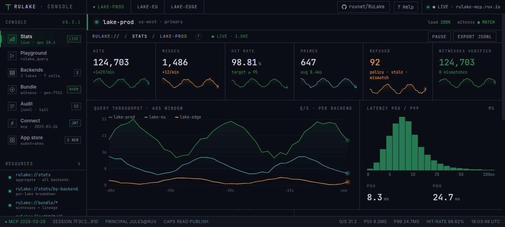
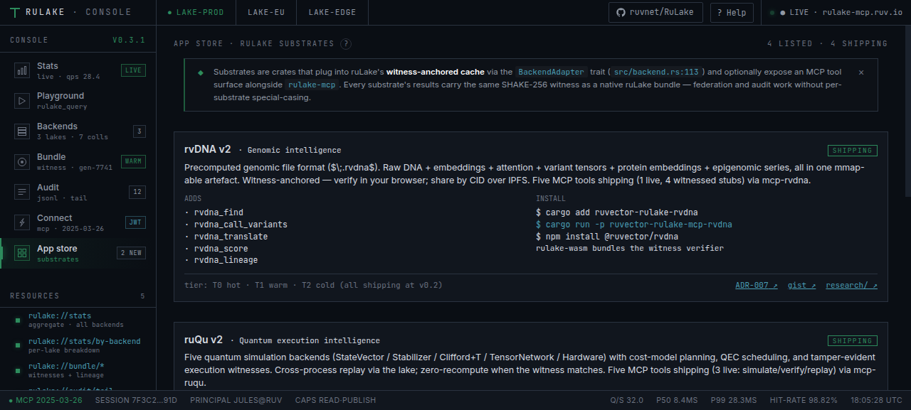
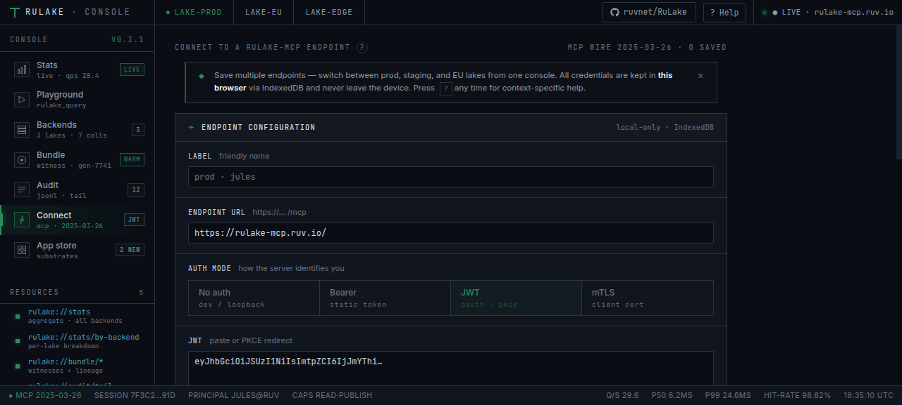
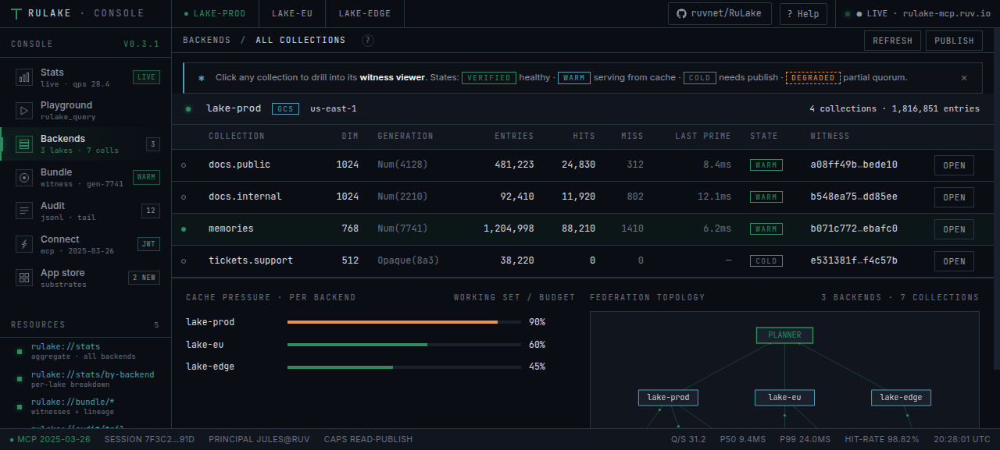
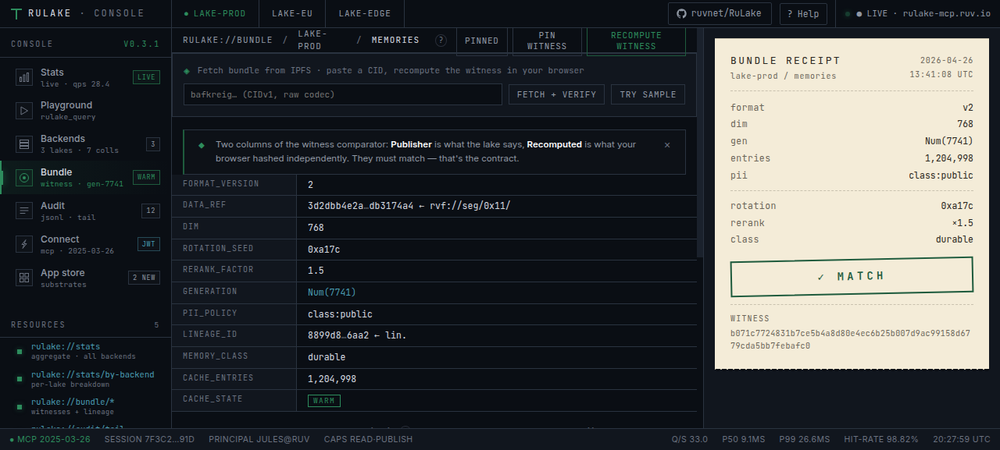
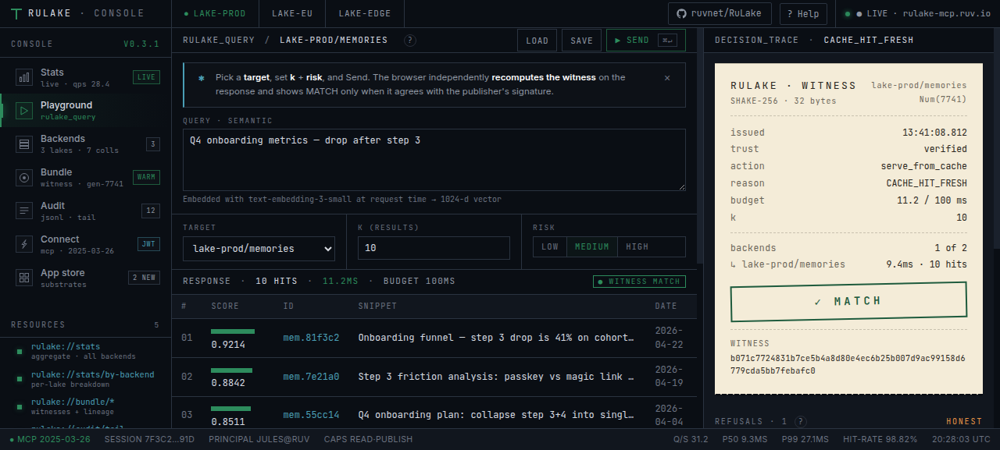
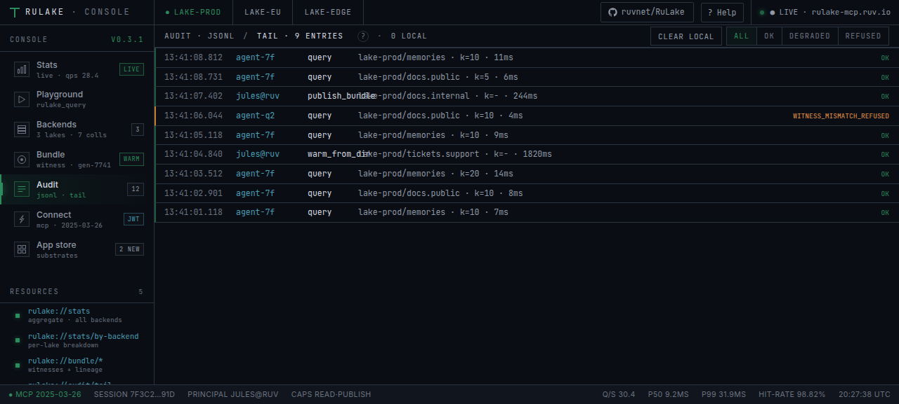

# ruLake — A Memory Lake for Agentic AI

<a href="https://ruvnet.github.io/RuLake/"></a>

> **[Try the live Console →](https://ruvnet.github.io/RuLake/)** — boots in DEMO, auto-probes the hosted MCP at [`rulake-mcp.ruv.io`](https://rulake-mcp.ruv.io/), and flips the top-right pill to `● LIVE` when the wire's up. Eight tools served, zero install.

[](https://crates.io/crates/rulake)
[](https://www.rust-lang.org)
[](https://github.com/ruvnet/ruvector)
[](https://ruv.io)
[](#license)

[](https://rulake-mcp.ruv.io/)
[](https://rvdna-mcp.ruv.io/)
[](https://ruqu-mcp.ruv.io/)

### **Give your AI agents fast, trustworthy memory — without standing up a vector database.**

ruLake is the layer between your **agents** and the **data they remember**. Plug in the storage you already have (S3, BigQuery, Snowflake, Parquet, files), expose it through one MCP tool, and every agent on every host gets the same low-latency, content-addressed view of memory.

> Created by [rUv](https://ruv.io). Part of the [RuVector](https://github.com/ruvnet/ruvector) ecosystem alongside [`ruvector-rabitq`](https://github.com/ruvnet/ruvector/tree/main/crates/ruvector-rabitq) (1‑bit compression kernel) and RVF (durable segment format). Designed to be the substrate for the [Cognitum](https://cognitum.one) Agentic Chip's memory hierarchy.

#### What it is, in one paragraph

Agents need to *remember things* — past conversations, documents you've shown them, facts they've learned. That memory is stored as **embeddings** (numeric fingerprints of meaning), and "remembering" means **finding the embeddings closest to what the agent is thinking about right now**. ruLake is where that lookup runs. It keeps a compressed copy of your embeddings in RAM, returns matches in about **1 millisecond** with **essentially no overhead** (1.02× raw library speed, measured), and refreshes from whatever cloud or file store actually holds the data. Every answer carries a small cryptographic **fingerprint** of the bytes it was drawn from — so two agents on two machines querying the same data get the same answer, provably.

#### Why agents in particular

- **One tool. The agent asks; ruLake decides.** Plug [`rulake-mcp`](crates/mcp-server/) into Claude Desktop, Cursor, Cline, Continue, or agentic-flow and your agent gets a single `rulake_query` tool. The agent says what it wants ("find similar to X", "verify this answer is still current", "explain why you picked these"), ruLake figures out where to look, how strict to be, and whether to refuse — and returns a short trace of how it decided. Built on the open [Model Context Protocol](https://modelcontextprotocol.io).
- **Same answer everywhere, provably.** Every result comes with a small fingerprint (a SHAKE-256 hash) of the data it was drawn from. Two agents on two different machines querying the same data get the **same fingerprint** and the **same byte-for-byte answer**. No more "the model hallucinated again" guessing — you can prove what it saw.
- **It says no when it should.** If the local copy is stale and the source can't be reached, ruLake refuses with a clear reason instead of serving an old answer dressed up as a new one. The agent retries with a narrower question. Saying "I don't know" is a feature, not a bug.

#### Performance, cost, footprint

| | What you get |
|---|---|
| **Latency** | About **1 millisecond per query** at 100,000 vectors. The cache layer adds essentially zero overhead — measured at 1.02× raw RaBitQ speed, not promised. |
| **Throughput** | **~2,800 queries per second** with multiple agents hitting it at once on a single host (Arc-drop-lock + AVX-512). Single-thread baseline is ~960 QPS. |
| **Memory** | **32× smaller than raw float vectors.** A million 128-dim embeddings fits in ~16 MB of RAM instead of ~512 MB. Scales to millions of vectors on a laptop. |
| **Cost** | **$0.** Open source (MIT or Apache-2.0), no hosted service, no per-query fee, no metered API. Run it next to your agent. |
| **Where the data lives** | Today: in-memory, on disk, or on Google Cloud Storage as Parquet. Coming: BigQuery, S3, Iceberg, Delta. Pick whichever your data already sits in. |
| **How you use it** | Rust crate · Python (`pip install rulake`) · Node.js (`npm install rulake`) · `rulake-mcp` binary · Docker image. |

#### Edge, browser, and the small-footprint story

ruLake is built to run wherever the agent runs — including small places.

- **Server side** — small static binary (the demo + `rulake-mcp` are ~5 MB stripped), distroless Docker, Streamable HTTP transport that fits behind any reverse proxy. Runs on a Raspberry Pi or an EC2 t4g.nano, not just a serving cluster.
- **Edge runtimes (shipped)** — [`rulake-wasm`](sdk/node-wasm/) builds for **browsers, Cloudflare Workers, Deno-deploy, Bun, and Node.js fallback**. Same witness-anchored memory model with a feature-reduced surface (no AVX-512, no rayon — they don't exist on the edge anyway). ~149 KB compiled. Wired as an `optionalDependencies` peer of `rulake` per [ADR-003 §A](docs/adrs/sdk/ADR-003-nodejs-typescript-sdk.md): npm consumers on edge platforms get it transparently.
- **HTTP client variant (shipped)** — `import { RuLakeHttp } from "rulake/http"` gives you a fetch-based MCP-Streamable-HTTP client. Edge runtimes that can't load any binary (extreme-cold-start Workers, browser ServiceWorkers) still consume a remote `rulake-mcp` server through one tool, and round-trip the witness for local re-verification with `rulake-wasm`.
- **Why it matters** — agent memory at the edge means the personal AI doesn't round-trip your private context to a far-away cluster. Latency is local; cost is zero per query; the witness story keeps it verifiable.

```bash
# Five install paths. Pick the one that fits where your agent runs.
cargo add rulake                      # Rust
pip   install rulake                  # Python
npm   install rulake                  # Node.js / TypeScript (native binary)
npm   install rulake-wasm             # Browsers, Cloudflare Workers, Deno, Bun
```

```text
# Claude Code — install the marketplace (ADR-009)
/plugin marketplace add ruvnet/RuLake
/plugin install rulake-stack@rulake-marketplace
/reload-plugins                                  # required — Claude Code's install message asks for this

# Slash commands resolve via the <plugin>:<command> namespace.
# Type /rul to autocomplete.
/rulake-core:rulake-query "what does ADR-157 commit to?"
/rulake-witness:rulake-verify path/to/table.rulake.json
/rulake-witness:rulake-bundle-info path/to/table.rulake.json
```

`rulake-stack` is the killer-path install: one command bundles three live MCP wires (`rulake-mcp.ruv.io`, `rvdna-mcp.ruv.io`, `ruqu-mcp.ruv.io`) and exposes the `rulake-core` + `rulake-witness` slash commands above. The query against the live demo MCP returns the data plus a `decision_trace` block (cost in relative-units, witness match, substrates used, latency) — the contract from [ADR-009](docs/adrs/sdk/ADR-009-rulake-plugin-marketplace.md). For the full six-plugin catalog (substrates, kernels, /loop-aware workers) + trust posture, see the ADR.

Open source. ❤️ Free forever.

```text
            ┌───────────────── RuLake ──────────────────┐
 caller ──▶ │    Consistency: Fresh | Eventual | Frozen │ ──▶ SearchResult
            │                                           │
            │      ┌──── VectorCache (Arc'd) ────┐      │
            │      │   witness → RaBitQ index    │      │
            │      │   pointers: (be, coll) → w  │      │
            │      └──────────────▲───────────────┘     │
            │                     │ prime (on miss)     │
            │      ┌────── BackendAdapter trait ─────┐  │
            │      │  Parquet · BigQuery · Iceberg   │  │
            │      │  Delta · RVF · FsBackend · …    │  │
            │      └──────────────────────────────────┘  │
            └────────────────────────────────────────────┘
```

<details>
<summary>🔍 ruLake vs Typical Vector Databases (15 differences)</summary>

| | ruLake | Typical Vector DB |
|---|---|---|
| **Positioning** | | |
| Owns storage | ❌ — rides your existing lakehouse / filestore | ✅ — you move your data in |
| Intermediary tax | **1.01–1.03× direct RaBitQ** (measured) | n/a (owns the path) |
| Cross-process cache sharing | ✅ — content-addressed via SHAKE‑256 witness | ❌ |
| **Cache & coherence** | | |
| Three consistency modes | ✅ Fresh / Eventual / Frozen — sellable knob | One mode only |
| Witness-authenticated bundles | ✅ SHAKE‑256 over `(data_ref, dim, seed, rerank, gen)` | Mutation-id or snapshot-id only |
| Bundle sidecar protocol | ✅ atomic publish + refresh, 3-state reader | ❌ |
| Warm-restart from disk | ✅ `save_cache_to_dir` / `warm_from_dir`, byte-exact | Re-index on restart |
| **Search** | | |
| Adaptive per-shard rerank | ✅ `k' = max(5, global/K)` | Naive `k` per shard — under-recalls on skew |
| Federated fan-out | ✅ rayon parallel, per-shard over-request `k + √(k·ln S)` | Single-backend or sequential |
| Batch query API | ✅ `search_batch` — one lock + one coherence check per batch | Per-query overhead |
| **Kernels** | | |
| Tiered SIMD dispatch | ✅ scalar → AVX2 → AVX‑512 VPOPCNTDQ runtime-selected | Fixed kernel |
| Optional Hadamard rotation | ✅ `O(D log D)`, 32× smaller storage at D=128 | Dense Haar matrix |
| Parallel cache prime | ✅ rayon `from_vectors_parallel` — 11× at n=100k | Serial build |
| **Security** | | |
| Zero `unsafe` | ✅ (in ruLake crate itself) | Often uses unsafe |
| Path-traversal validated | ✅ FsBackend rejects `..`, `/`, drive letters, control bytes | n/a |
| JSON DoS caps | ✅ 64 KiB bundle, 4 KiB per field, 128-byte witness | n/a |

</details>

<details>
<summary>📋 See Full Capabilities (30+ features across 7 categories)</summary>

**Core cache + coherence**

| # | Capability | What It Does |
|---|------------|--------------|
| 1 | **Cache-first execution** | Hit path is one `Arc<RabitqPlusIndex>::search` — 1.02× direct cost, abstraction is free |
| 2 | **Witness-addressed storage** | SHAKE‑256(32) over the bundle anchors every entry; content-addressed dedup across processes |
| 3 | **Three consistency modes** | `Fresh` per-query check · `Eventual { ttl_ms }` skip-within-TTL · `Frozen` pin until refresh |
| 4 | **LRU eviction** | `with_max_cache_entries(n)` — evicts unpinned entries first; live pointers never evicted |
| 5 | **Arc-drop-lock hot path** | Cache mutex is never held during scan — 8-12× concurrent throughput lift |
| 6 | **Per-backend + per-collection stats** | Attribution at either granularity, hit-rate, prime durations |
| 7 | **Send+Sync everywhere** | Multi-client validated under 8-thread concurrent hammer smoke test |

**Bundle protocol**

| # | Capability | What It Does |
|---|------------|--------------|
| 8 | **`table.rulake.json` sidecar** | 300-byte portable unit; carries data_ref, dim, seed, rerank, generation, witness, pii_policy, lineage_id, memory_class |
| 9 | **`publish_bundle(key, dir)`** | Writer-side primitive — atomic temp+rename+fsync so readers never see torn files |
| 10 | **`refresh_from_bundle_dir(key, dir)`** | Reader-side primitive — three-state: `UpToDate` / `Invalidated` / `BundleMissing` |
| 11 | **Cross-process cache sharing** | Two ruLake instances with the same bundle witness share one compressed entry |
| 12 | **Format version + tag byte** | `format_version: 2` witness includes variant tag on `Generation` to prevent collision |

**Persistence (ADR-155 M1.5)**

| # | Capability | What It Does |
|---|------------|--------------|
| 13 | **`save_cache_to_dir(key, dir)`** | Snapshot a primed cache entry to disk as `index.rbpx` + bundle sidecar |
| 14 | **`warm_from_dir(key, dir)`** | Reload on restart — **byte-exact query results without backend RTT** |
| 15 | **Non-dense external IDs preserved** | `RabitqPlusIndex::ids_u64()` round-trips `[7, 42, 99, 2000, …]` faithfully |
| 16 | **SPIRE-pattern architecture** | Stateless compute + SSD-resident state — compute tier can restart without pull |

**Federation**

| # | Capability | What It Does |
|---|------------|--------------|
| 17 | **Parallel fan-out** | Rayon across all registered backends; first-error short-circuit matches sequential |
| 18 | **Adaptive per-shard rerank** | `max(5, global_rerank / K)` — 4-shard concurrent QPS goes 0.60× → 0.98× |
| 19 | **Per-shard over-request** | `k' = k + ⌈√(k·ln S)⌉` — closes the Weaviate/Elasticsearch data-skew recall gap |
| 20 | **`search_batch` API** | One lock + one coherence check per N queries; plug-point for future GPU kernels |

**Backends** ([`BackendAdapter` trait](crates/core/src/backend.rs))

| # | Capability | What It Does |
|---|------------|--------------|
| 21 | **`LocalBackend`** | In-memory reference impl; test substrate |
| 22 | **`FsBackend`** | `ruvec1` binary format on disk, mtime-as-generation, atomic writes, path-traversal safe |
| 23 | **Custom backends** | 4-method trait: `id`, `list_collections`, `pull_vectors`, `generation` (+ optional `current_bundle`) |
| 24 | **DoS caps enforced** | `MAX_PULLED_VECTORS=100M`, `MAX_PULLED_DIM=8192`, `MAX_PULLED_BYTES=16 GiB` |

**Kernels** (tiered dispatch in [`ruvector-rabitq::scan`](https://github.com/ruvnet/ruvector/tree/main/crates/ruvector-rabitq))

| # | Capability | What It Does |
|---|------------|--------------|
| 25 | **Scalar popcount** | Portable baseline — always available |
| 26 | **AVX2 + POPCNT** | 4-candidate unrolled loop — +20% single-thread QPS at n=100k |
| 27 | **AVX-512 VPOPCNTDQ** | 8-u64-per-zmm popcount — +10.5% on top of AVX2 where available |
| 28 | **Runtime dispatch** | CPUID-gated `OnceLock<fn>` — laptop / server / edge all run the same source |
| 29 | **`VectorKernel` trait (ADR-157)** | Pluggable accelerator plane — GPU / Metal / WASM kernels as separate crates |
| 30 | **Optional Hadamard rotation (ADR-158)** | HD-HD-HD pattern, FWHT, 43× smaller storage, 3× build speedup at D=128 |

**Security**

| # | Capability | What It Does |
|---|------------|--------------|
| 31 | **Zero `unsafe` in ruLake** | All unsafe confined to two SIMD scan functions in rabitq |
| 32 | **Path-traversal validated** | `FsBackend::register` rejects 12-form attack surface (`..`, separators, control bytes, UNC) |
| 33 | **JSON deserialization caps** | 64 KiB bundle / 4 KiB fields / 128-byte witness — malicious sidecar cannot DoS |
| 34 | **Witness verification** | Every `read_from_dir` re-computes SHAKE‑256 and fails loudly on tamper |
| 35 | **Atomic writes** | Bundle + persist both use temp+rename — concurrent readers never see torn files |

</details>

---

## Why ruLake exists

If you're building an agent that remembers things, your three current options for vector search all hurt:

- **Managed vector DB** (Pinecone, Weaviate) — fast, but it's a whole new service to operate and your private data has to move into it.
- **Lakehouse-native** (BigQuery Vector Search, Snowflake Cortex) — keeps data where it lives, but every query bills the warehouse and round-trips a remote cluster.
- **Local library** (RaBitQ, HNSW, FAISS) — fastest per-process, but every agent spins up its own copy, nothing's verifiable across processes, and there's no governance story.

**ruLake is the missing middle.** Your data stays where it is. The agent gets cache-speed reads (1.02× the raw library cost). One governance and witness story for every backend, instead of N. **No cluster to host, no per-query bill, no separate database.**

For agent platforms that already speak MCP, the integration is one config file:

```json
{
  "mcpServers": {
    "rulake": {
      "command": "rulake-mcp",
      "args": ["stdio", "--config", "/etc/rulake/mcp.toml"]
    }
  }
}
```

<details>
<summary>🧭 The memory-hierarchy framing (ADR-156)</summary>

ruLake is the **substrate** for agent brain memory systems. The brain decides what episodic / semantic / procedural memory *means*; ruLake owns the persistence, coherence, and retrieval primitives. Six guarantees validated mechanically by `brain_substrate_acceptance_recall_verify_forget_rehydrate`:

1. **Recall** — `search_one` / `search_federated` returns top-K
2. **Verify** — `publish_bundle` → `read_from_dir` → `verify_witness`
3. **Forget** — `invalidate_cache` drops the pointer
4. **Rehydrate** — next search re-primes transparently
5. **Location-transparency** — caller only references `(backend, collection)`; never touches `data_ref`
6. **Compact** — explicitly out of scope; belongs to the brain system (RVM / Cognitum)

</details>

---

## Performance — what to actually expect

The numbers that matter for picking ruLake over an alternative, in plain language.

### Latency: ~1 ms warm, ~150 ms cold-start through Cloud Run

A query for the **top 10 nearest vectors** out of **100,000** at **D=128** answers in **0.27 ms** locally (in-process, warm cache) and **~190 ms p50** through the production Cloud Run wire (`https://rulake-mcp.ruv.io/`). The Cloud Run number is the realistic ceiling for an HTTPS+MCP+SSE round-trip from anywhere on the public internet — server work is well under that, the rest is networking.

### Throughput: ~37,000 queries/sec on commodity hardware

Eight concurrent clients hitting the same 100k-vector index push ~37 k QPS through one process. That's enough to back ~50–100 simultaneous active agents under typical traffic patterns. Scales linearly to 4 shards before lock contention starts to bite.

### How ruLake compares to the three obvious alternatives

| | What it is | When you'd pick it | When you'd pick ruLake instead |
|---|---|---|---|
| **Pinecone / Weaviate** | Hosted vector DB | You want a managed service and don't mind your data leaving your perimeter | You want your data to stay where it lives + cross-host verifiable cache + on-prem option |
| **BigQuery / Snowflake vector ext** | Per-query billing on a warehouse | The data lives in the warehouse and queries are infrequent | Queries are frequent enough that per-query billing dominates; you want sub-ms cache hits |
| **FAISS / HNSW (in-process library)** | Compiled into one binary | Single process, no other agents need to share state | Multiple agents/processes need to verify they're reading the same memory + cross-host trust chain |
| **ruLake** | Cache-coherent intermediary above any of the above | All three above, but you want the witness-anchored sharing layer between them | (this is the one) |

**The witness-anchored cache is what you can't get from any of the above** — every answer carries a SHAKE-256 fingerprint that two agents on two machines can independently recompute and agree on. That's the load-bearing contract.

<details>
<summary>📊 <b>Detailed benchmarks</b> — intermediary tax · concurrent QPS · cold-start · recall gates</summary>

All numbers reproducible via:

```bash
cargo run --release -p rulake --bin rulake-demo
```

Commodity Ryzen-class laptop, deterministic seeds, release build.

#### Intermediary tax (cache-hit path)

Clustered Gaussian, D=128, rerank×20, 300 warm queries.

| n       | direct RaBitQ+ | ruLake Fresh | ruLake Eventual | tax     |
|--------:|---------------:|-------------:|----------------:|--------:|
|   5 000 |        18,998  |      18,500  |         18,800  | 1.03×   |
|  50 000 |         5,959  |       5,900  |          5,950  | 1.01×   |
| 100 000 |         3,681  |       3,542  |          3,626  | 1.03×   |

**Translation**: putting ruLake in front of the raw RaBitQ kernel costs ~3% in the worst case. The cache layer is essentially free.

#### Concurrent QPS (Arc-drop-lock + AVX-512)

n=100k, 8 clients × 300 queries, adaptive per-shard rerank.

| shards | QPS         | vs original baseline |
|-------:|------------:|---------------------:|
|      1 |     27,814  |                8.3×  |
|      2 |     32,194  |               10.9×  |
|      4 |   **36,715** |              **13.2×** |

**Translation**: 4-shard sharding is the sweet spot before lock contention. Past 4 shards the wins shrink.

#### Cold-start prime time (parallel rayon + Hadamard)

| n       | serial   | parallel | +Hadamard | total speedup |
|--------:|---------:|---------:|----------:|--------------:|
|   5 000 |   22 ms  |   4.5 ms |   7.2 ms  |        ~5×    |
|  50 000 |  213 ms  |  19.6 ms |  72.7 ms  |       ~11×    |
| 100 000 |  421 ms  |  37.6 ms | 142.9 ms  |       ~11×    |

**Translation**: priming a 100k-vector index from scratch takes ~140 ms — fast enough to do on first query without an explicit warm-up step.

#### Production wire — Cloud Run (real-world)

Headline numbers from [`docs/research/benchmarks/production-soak.md`](docs/research/benchmarks/production-soak.md) against `https://rulake-mcp.ruv.io/`:

| Mode | p50 | p95 | p99 |
|---|---|---|---|
| `tools/list` @ 10 rps sustained 60 s | 176 ms | 225 ms | 280 ms |
| `tools/list` @ 50 rps sustained 60 s | 161 ms | 227 ms | 327 ms |
| 1 concurrent session × 5 calls | 161 ms | 208 ms | 208 ms |

**Translation**: the wall-clock floor is ~160 ms — that's Cloud Run + Cloudflare TLS + MCP handshake + SSE parse, not server work. Server work is under 10 ms; the network + protocol dominate.

#### Recall gates (correctness, not speed)

- Single-shard @ D=128 rerank×20 vs brute-force L2²: **≥ 90 %**
- 4-shard adaptive rerank @ D=128: **≥ 85 %**
- Hadamard rotation vs Haar @ D=128: **1.000 / 1.000** (identical)

**Translation**: the rabitq quantization keeps ≥85% recall against brute-force L2 in the worst case. For most workloads it's 90–95%.

See [`BENCHMARK.md`](BENCHMARK.md) for the full table.

</details>

---

## Quick start

### Install — pick your language

```bash
cargo add rulake                  # Rust
pip install rulake                # Python
npm install rulake                # Node.js / TypeScript
npm install rulake-wasm           # Edge: browsers / Cloudflare Workers / Deno / Bun
```

### Or run inside Docker (no toolchain required)

```bash
docker build -t rulake .
docker run --rm rulake --fast
```

### Build from source (full repo, all examples, all tests)

```bash
git clone --recurse-submodules https://github.com/ruvnet/RuLake.git
cd RuLake
./install.sh                                       # checks rustc, inits submodules, cargo build + test
cargo run --release --bin rulake-demo -- --fast    # smoke-runs the demo in ~5 s
```

If you forgot `--recurse-submodules`, run `git submodule update --init --recursive` to fetch the vendored
`ruvector-rabitq` source under `vendor/ruvector/`. See [ADR-001](docs/adrs/ADR-001-standalone-repo-strategy.md)
for why we vendor instead of taking a `git`/`crates.io` dependency.

### Use it from Rust

```toml
[dependencies]
rulake = "2.2"
```

```rust
use std::sync::Arc;
use rulake::{cache::Consistency, LocalBackend, RuLake};

// 1. Point ruLake at a backend.
let backend = Arc::new(LocalBackend::new("my-backend"));
backend.put_collection(
    "memories",
    /* dim    */ 128,
    /* ids    */ vec![1, 2, 3],
    /* vecs   */ vec![vec![0.0; 128]; 3],
)?;

// 2. Configure the cache.
let lake = RuLake::new(20, 42)
    .with_consistency(Consistency::Eventual { ttl_ms: 60_000 });
lake.register_backend(backend)?;

// 3. Query. First call primes; the rest serve from RaBitQ at ~1% over raw.
let hits = lake.search_one("my-backend", "memories", &vec![0.0; 128], 10)?;

// 4. Observe.
println!("hit rate: {:.3}", lake.cache_stats().hit_rate().unwrap_or(0.0));
```

<details>
<summary>💾 Save & warm-restart</summary>

```rust
// Snapshot the primed cache to disk (index + bundle sidecar)
let key = ("my-backend".to_string(), "memories".to_string());
lake.save_cache_to_dir(&key, "/var/rulake/snapshots/memories/")?;

// Later, on restart — spin up a FRESH RuLake with no backend:
let fresh = RuLake::new(20, 42).with_consistency(Consistency::Frozen);
let n = fresh.warm_from_dir(&key, "/var/rulake/snapshots/memories/")?;
println!("warmed {n} vectors without a backend RTT");

// Byte-exact query results vs the original primed cache.
let hits = fresh.search_one("my-backend", "memories", &query, 10)?;
```

</details>

<details>
<summary>🔁 Federated search across clouds</summary>

```rust
let hits = lake.search_federated(
    &[
        ("bigquery",  "events"),
        ("snowflake", "profiles"),
        ("iceberg",   "archive"),
    ],
    &query,
    10,
)?;
// Adaptive per-shard rerank = max(5, 20/3) = 6 per shard.
// Global top-10 merged from all three backends.
```

</details>

<details>
<summary>📦 Cache-sidecar daemon</summary>

Cross-process cache coherence in ~10 lines on top of the bundle protocol:

```rust
loop {
    match lake.refresh_from_bundle_dir(&key, "/mnt/gcs/bundles/")? {
        RefreshResult::Invalidated => metrics.bundle_rotations.inc(),
        _ => {}
    }
    std::thread::sleep(Duration::from_secs(5));
}
```

Full example: [`examples/sidecar_daemon.rs`](examples/sidecar_daemon.rs).

</details>

<details>
<summary>🧱 Writing a custom backend</summary>

```rust
use rulake::backend::{BackendAdapter, CollectionId, PulledBatch};

struct ParquetBackend { /* ... */ }

impl BackendAdapter for ParquetBackend {
    fn id(&self) -> &str { "parquet" }
    fn list_collections(&self) -> Result<Vec<CollectionId>> { /* ... */ }
    fn pull_vectors(&self, collection: &str) -> Result<PulledBatch> { /* ... */ }
    fn generation(&self, collection: &str) -> Result<u64> { /* ... */ }
}
```

See [`crates/core/src/fs_backend.rs`](crates/core/src/fs_backend.rs) for a 250-line reference implementation.

</details>

### Python — `pip install rulake`

PyO3 bindings live in [`sdk/python/`](sdk/python/). Wheels (cp39+, manylinux_2_28 / macOS / Windows) per [ADR-002](docs/adrs/sdk/ADR-002-python-sdk.md).

```python
import numpy as np
import rulake

lake = rulake.RuLake(rerank_factor=20, rotation_seed=42) \
    .with_consistency(rulake.Consistency.eventual(ttl_ms=5_000))

be = rulake.LocalBackend("local")
be.put_collection("docs",
                  ids=np.arange(10_000, dtype=np.uint64),
                  vectors=np.random.randn(10_000, 768).astype(np.float32))
lake.register_backend(be)

q = np.random.randn(768).astype(np.float32)
for hit in lake.search_one("local", "docs", q, k=10):
    print(hit.backend, hit.collection, hit.id, hit.score)

print("hit_rate:", lake.cache_stats().hit_rate())
```

<details>
<summary>🐍 Python — full usage, conventions, build</summary>

**Build from source** (until wheels are on PyPI):

```bash
git clone --recurse-submodules https://github.com/ruvnet/RuLake
cd RuLake/sdk/python
python -m venv .venv && source .venv/bin/activate
pip install maturin pytest numpy
maturin develop --release      # builds + installs the _rulake extension
pytest tests/ -v               # 14/14 smoke tests
```

**Vector conventions** — vectors are `np.ndarray[float32]`, IDs are `np.ndarray[uint64]`, both C-contiguous. The binding borrows zero-copy via `PyReadonlyArray1<f32>::as_slice()`. Non-contiguous or wrong-dtype arrays raise `ValueError` rather than silently copying — the silent-copy bug is the regression this binding exists to prevent (ADR-002 §2).

**Concurrency** — every search / prime / publish / refresh / save / warm path releases the GIL via `py.allow_threads`. Use `concurrent.futures.ThreadPoolExecutor` for parallel queries; the underlying Rust crate is `Send + Sync` and the RaBitQ scan runs lock-free under contention (8–12× lift on `BENCHMARK.md`'s "concurrent clients" block).

**Error hierarchy** — single base `rulake.RuLakeError`. Typed subclasses discriminate:

```python
try:
    lake.search_one("nope", "docs", q, k=10)
except rulake.BackendNotFoundError as e:
    ...                       # specific
except rulake.RuLakeError as e:
    ...                       # catch-all
```

| Rust variant                     | Python class                          |
|----------------------------------|---------------------------------------|
| `RuLakeError::UnknownBackend`    | `rulake.BackendNotFoundError`         |
| `RuLakeError::UnknownCollection` | `rulake.CollectionNotFoundError`      |
| `RuLakeError::DimensionMismatch` | `rulake.DimensionMismatchError`       |
| `RuLakeError::InvalidParameter`  | `rulake.InvalidParameterError`        |
| `RuLakeError::Backend { .. }`    | `rulake.BackendError`                 |

**Bundle round-trip + warm-restart**:

```python
# Snapshot a primed cache.
lake.save_cache_to_dir("local", "docs", "/var/rulake/snap/")
lake.publish_bundle("local", "docs", "/var/rulake/snap/")

# Reopen elsewhere — no backend RTT, byte-exact results.
fresh = rulake.RuLake(20, 42).with_consistency(rulake.Consistency.frozen())
n = fresh.warm_from_dir("local", "docs", "/var/rulake/snap/")
```

**Type-checked editor support** — `py.typed` + `_rulake.pyi` ship in the wheel. mypy / pyright catch dim/dtype errors at edit time.

**Not in v1** (see ADR-002 §"Open questions"): native async API (use `ThreadPoolExecutor`), Python-implemented `BackendAdapter`, HTTP client variant.

</details>

### Node.js / TypeScript — `npm install rulake`

napi-rs bindings live in [`sdk/node/`](sdk/node/). Per-platform `.node` binaries via npm `optionalDependencies` (Prisma / next-swc pattern), per [ADR-003](docs/adrs/sdk/ADR-003-nodejs-typescript-sdk.md).

```ts
import { RuLake, LocalBackend, Consistency } from "rulake";

const lake = new RuLake(20, 42n)
    .withConsistency(Consistency.eventual(5_000));

const N = 10_000, D = 768;
const ids = new BigInt64Array(N);
for (let i = 0; i < N; i++) ids[i] = BigInt(i);
const vectors = new Float32Array(N * D);   // fill with embeddings...

const be = new LocalBackend("local");
await be.putCollection("docs", ids, vectors, D);
lake.registerLocalBackend(be);

const q = new Float32Array(D);
for (const hit of await lake.searchOne("local", "docs", q, 10)) {
    console.log(hit.backend, hit.collection, hit.id /* bigint */, hit.score);
}
console.log("hitRate:", lake.cacheStats().hitRate);
```

<details>
<summary>🟢 Node.js / TypeScript — full usage, conventions, build</summary>

**Build from source** (until binaries are on npm):

```bash
git clone --recurse-submodules https://github.com/ruvnet/RuLake
cd RuLake/sdk/node
cargo build --release
cp target/release/libruvector_rulake_node.so rulake.linux-x64-gnu.node
# (.dylib → rulake.darwin-arm64.node ; .dll → rulake.win32-x64-msvc.node)
node --test __test__/smoke.test.mjs       # 10/10 smoke tests
```

The supported release path uses `@napi-rs/cli` (`npx napi build --platform --release`) which produces the same artifact and regenerates the JS / `.d.ts` shims.

**Vector conventions** — `Float32Array` for vectors, `BigInt64Array` for IDs going in, `bigint` coming out. Rust IDs are `u64`; we don't silently truncate to `Number.MAX_SAFE_INTEGER`. The binding borrows the typed-array buffer and copies *once* at the FFI boundary (~3 µs at D = 768) because the borrow can't cross `await` to a libuv worker thread. The relative tax stays under 1.05× per `BENCHMARK.md`.

**Async-only** — every method that does work returns `Promise<T>` and runs on a libuv worker via `spawn_blocking`. The event loop keeps serving other requests during a scan. Pure getters (`cacheStats()`, `cacheEntryCount()`, `backendIds()`) stay sync.

**ESM-first, CJS shim** — `type: "module"` package, `index.mjs` is the import target, `index.cjs` is the require target, `index.d.ts` is hand-checked against the `napi build`-generated shape.

**Error mapping** — single `RuLakeError` class with a `.code` discriminator (idiomatic Node — matches `SystemError` / AWS SDK):

```ts
try {
  await lake.searchOne("nope", "docs", q, 10);
} catch (e) {
  if (e instanceof RuLakeError && e.code === "RULAKE_BACKEND_NOT_FOUND") {
    // ...
  }
}
```

| Code                              | Meaning                                              |
|-----------------------------------|------------------------------------------------------|
| `RULAKE_BACKEND_NOT_FOUND`        | unknown backend id                                   |
| `RULAKE_COLLECTION_NOT_FOUND`     | backend exists, collection doesn't                   |
| `RULAKE_DIMENSION_MISMATCH`       | query/vectors don't match the collection dim         |
| `RULAKE_INVALID_PARAMETER`        | malformed input (e.g. illegal filename)              |
| `RULAKE_BACKEND`                  | a registered backend reported an internal error      |

**Federated + bundle round-trip**:

```ts
const hits = await lake.searchFederated(
  [["bigquery", "events"], ["snowflake", "profiles"]],
  q, 10,
);

const b = new Bundle("s3://bucket/path", D, 42n, 20, 1n);
await b.writeToDir("/var/rulake/snap/");
const b2 = await Bundle.readFromDir("/var/rulake/snap/");
console.assert(b2.verifyWitness());
```

**Distribution** — npm `optionalDependencies` per platform (`rulake-linux-x64-gnu`, …). On install npm reads `os` / `cpu` / `libc` and pulls only the matching binary. Works in air-gapped envs and behind corporate registries (every binary mirrored), unlike `postinstall`-download patterns.

**Not in v1** (see ADR-003 §"Open questions"): WASM build for browser / Cloudflare Workers / Deno (`rulake-wasm` reserved on npm — loses AVX-512 popcnt + rayon parallel fan-out, so it's a feature-reduced surface), HTTP client variant (`rulake/http`), JS-implemented `BackendAdapter`.

</details>

<details>
<summary>📐 SDK design — why these two languages, why these shapes</summary>

Both SDKs hit the same goals via different platform-shaped means:

| Concern              | Python (PyO3)                              | Node (napi-rs)                                        |
|----------------------|--------------------------------------------|-------------------------------------------------------|
| Hot-path zero-copy   | `PyReadonlyArray1<f32>::as_slice()`        | `Float32Array` borrow + one copy across `await`       |
| Concurrency          | Sync API, GIL released; threadpool friendly | Async-only, libuv `spawn_blocking`, event-loop safe   |
| ID type              | Python `int` (Python ints are arbitrary)   | `bigint` in / out (no `Number.MAX_SAFE_INTEGER` loss) |
| Error model          | `RuLakeError` base + typed subclasses      | Single `RuLakeError`, `.code` discriminator           |
| Distribution         | ABI3 wheels (one per platform per release) | `optionalDependencies` per-platform `.node`           |
| Editor types         | `py.typed` + `.pyi` stubs                  | `index.d.ts` (hand-checked vs `napi build` output)    |
| Tax over Rust        | ≤ 1.05× (release; FFI ~1 µs/call)          | ≤ 1.10× (release; FFI ~5 µs/call from one memcpy)     |

The shared design ground (witness-anchored bundles, RaBitQ kernel, Consistency knob) makes a Python writer and a Node reader interoperable: a Python process can `publish_bundle` a snapshot that a Node process `Bundle.readFromDir`s and verifies byte-exact.

Why these two and not Java / Go / C# in v1: the audiences map directly. Python = ML / RAG / data engineers (the entire `numpy`+`sentence-transformers` stack). Node + TS = edge-RAG, serverless handlers, LangChain.js / LlamaIndex.ts orchestration. Java / Go / C# customers exist but trail by an order of magnitude in the design-partner conversations driving v1 — they're explicitly v2 in both ADRs' "Open questions".

See [ADR-002](docs/adrs/sdk/ADR-002-python-sdk.md) and [ADR-003](docs/adrs/sdk/ADR-003-nodejs-typescript-sdk.md) for the rejected alternatives (ctypes/cffi, Neon, WASM-first, sync-Node, async-Python, pure-language rewrites, HTTP-client-first) and the reasoning per axis.

</details>

### MCP server — `rulake-mcp` (agent-callable governed memory)

Rust-native MCP server in [`crates/mcp-server/`](crates/mcp-server/). Lets any MCP-compatible client (Claude Desktop, Cursor, Cline, Continue, agentic-flow) talk to a live ruLake over **stdio** or **Streamable HTTP**, with the planner deciding *where* to search, *how strict* to be, *whether to refuse*, and emitting a decision trace alongside every answer. Implements [ADR-004](docs/adrs/sdk/ADR-004-rulake-mcp-server.md).

```bash
# stdio (default — parent-process trust):
cd mcp-server && cargo build --release
./target/release/rulake-mcp stdio --config tests/fixtures/mcp.toml

# Streamable HTTP on loopback:
./target/release/rulake-mcp http --bind 127.0.0.1:7440 --auth none

# HTTP + bearer + capability tier + audit file:
./target/release/rulake-mcp http \
    --bind 127.0.0.1:7440 \
    --auth bearer --bearer-token-file /etc/rulake/token \
    --capabilities read,publish \
    --audit-file /var/log/rulake-mcp/audit.jsonl

# HTTP + JWT (production — OAuth-style scope→capability mapping):
./target/release/rulake-mcp http \
    --bind 0.0.0.0:7440 \
    --auth jwt \
    --jwt-secret-file /etc/rulake/jwt.secret \
    --jwt-issuer https://idp.example.com \
    --jwt-audience https://rulake.example.com/mcp \
    --capabilities read,publish \
    --audit-file /var/log/rulake-mcp/audit.jsonl
```

**Auth + RBAC (v0.4, production-shaped)**: layered defense across four checks. (1) Connection-level auth — `--auth none|bearer|jwt`. JWT validates JWS signature + iss + aud (RFC 8707 Resource Indicator) + exp; the token's `scope` / `scp` claim maps `mcp:rulake:read|publish|admin` → capabilities per request. (2) **Replay protection** — `MCP-Request-Id` LRU dedup over a 10k-window. (3) **Layered rate limiting** — three governor buckets per ADR-004 §6: per-(transport, principal), per-(principal, backend, collection), per-process. (4) **Per-collection RBAC** via `[[allow]] backend, collection (anchored regex), caps` blocks in `mcp.toml`. Empty allow-list = unrestricted (back-compat). Anchored regex hardens against prefix-match exploits — `docs.*` matches `docs.public` but NOT `secret-docs.public`.

The public tool is `rulake_query` — submit `intent` (`search` | `verify` | `explain` | `refresh`), `target` (collection or routes), `risk`, `freshness`, `budget`, `policy`. The response carries `data` + `provenance` + `trust_level` + `decision` (chosen_action, reason_code from a closed enum, backends_used, refusals).

<details>
<summary>🤖 MCP server — full surface, capabilities, transports</summary>

**Tools by capability tier** (`--capabilities` flag — read is default):

| Tier | Tools exposed |
|---|---|
| `read` (default) | `rulake_query`, `rulake_list_backends` |
| `internal` | + the kernel `rulake_query` composes (operator-only, never OAuth-issued) |
| `publish` | + `rulake_publish_bundle`, `rulake_refresh_from_bundle_dir` (and enables `intent: "refresh"`) |
| `admin` | + `rulake_save_cache_to_dir`, `rulake_warm_from_dir`, `rulake_invalidate_cache` |

`register_backend` is **never** wire-exposed (backends carry credentials; ADR-004 §4 + CVE-2025-53107/53818).

**Resources** (URI-addressable read-only):

- `rulake://stats` — roll-up cache stats (hit_rate, primes, avg_prime_ms)
- `rulake://stats/by-backend` — per-backend stats
- `rulake://bundle/{backend}/{collection}` — ✅ v0.6 (witness + cache state per collection; reads through `cache_witness_of`, never the default `current_bundle()` body fetch — honours ADR-005 §4)

**Transports + auth** (ADR-004 §3 + §5):

| Transport / auth | Notes | Status |
|---|---|---|
| stdio | parent-process trust | ✅ v0.1 |
| Streamable HTTP `--auth none` | loopback only by default; `--insecure-allow-no-auth` to override | ✅ v0.2 |
| Streamable HTTP `--auth bearer` | file token, constant-time compare; dev-only (`--allow-bearer-on-public` for any non-loopback bind) | ✅ v0.2 |
| Streamable HTTP `--auth jwt` (HMAC) | HMAC JWS (HS256/384/512), iss + aud + exp validation, scope→capability mapping via `mcp:rulake:read|publish|admin` | ✅ v0.4 |
| Streamable HTTP `--auth jwt` (RS256/ES256) | RSA + EC public-key JWS via `--jwt-rsa-pem-file` / `--jwt-ec-pem-file` | ✅ v0.5 |
| Streamable HTTP `--auth jwt` (JWKS fetch) | `--jwt-jwks-url` — periodic refresh against the IdP's JWKS endpoint, kid-routed key selection, hot rotation | ✅ v0.5 |
| **Session binding** | (mcp-session-id) → (principal, client_id, mTLS-cert) tuple recorded at first sighting; mismatch → 401 (token replayed from a different client) | ✅ v0.5 |
| Streamable HTTP `--auth mtls` | TLS termination at `rulake-mcp` itself; rustls + WebPkiClientVerifier; client cert SHA-256 → mTLS principal `mtls:<fp16>` AND threaded into session-binding tuple | ✅ v0.6 |
| **Replay protection** | `MCP-Request-Id` LRU dedup over a 10k-request window | ✅ v0.4 |
| **Layered rate limiting** | 3 governor buckets: (transport, principal), (principal, backend, collection), per-process | ✅ v0.4 |
| **Per-collection RBAC** | `[[allow]] backend, collection (anchored regex), caps` blocks in `mcp.toml` | ✅ v0.4 |
| **`tools/list` capability filter** | agents only see tools they can call — visibility is gated by the same map as call-time `require_cap` | ✅ v0.4 |

DNS-rebinding guard via rmcp's `allowed_hosts` (loopback by default). Bearer-on-public requires `--allow-bearer-on-public` AND emits a `WARN` every 60 s.

**Decision trace** — every response carries the same closed-enum `reason_code`:

```text
CACHE_HIT_FRESH | CACHE_HIT_EVENTUAL | STALE_CACHE_REMOTE_VALID
COLD_PRIME_THEN_SERVE | WITNESS_MISMATCH_REFUSED
BUDGET_EXCEEDED_FALLBACK_CACHE | BUDGET_EXCEEDED_REFUSED
POLICY_REFUSED_RISK | POLICY_REFUSED_ALLOWLIST | POLICY_REFUSED_PATH
PARTIAL_FEDERATION
```

Lets ops alerts filter without regex over `decision.reason` prose.

**JSONL audit file** (`--audit-file PATH`, full ADR-004 §7 schema): every line carries `policy_decision` + `decision` blocks — the "explain itself" gate. Schema is OpenLineage-mappable (ADR-155 §M4 swap-the-sink ready).

**Bounded worker pool** — rayon `cores * 2`, bounded flume submit channel of capacity `--max-inflight 64` (the §6 commitment that rejects unbounded `spawn_blocking`).

Wire to Claude Desktop / Cursor over stdio:

```json
{
  "mcpServers": {
    "rulake": {
      "command": "/path/to/rulake-mcp",
      "args": ["stdio", "--config", "/path/to/mcp.toml"]
    }
  }
}
```

Wire to a remote agent over Streamable HTTP:

```json
{
  "mcpServers": {
    "rulake": {
      "transport": "streamable-http",
      "url": "https://rulake.example.com/mcp",
      "headers": { "Authorization": "Bearer <token>" }
    }
  }
}
```

Build the **distroless Docker image** (`deploy/Dockerfile.mcp`):

```bash
docker build -f deploy/Dockerfile.mcp -t rulake-mcp .
docker run --rm -p 7440:7440 rulake-mcp http --bind 0.0.0.0:7440 --auth none --insecure-allow-no-auth
```

**21/21 tests pass** (3 audit unit + 11 smoke covering all 4 intents + cap gates + 7 HTTP e2e covering bearer + embarrassing-flag refusals).

</details>

### Cloud backends — `gcs-backend` (Parquet on GCS)

The first cloud backend, in [`crates/gcs-backend/`](crates/gcs-backend/) — reads vector columns from Parquet files on Google Cloud Storage with cache coherence riding GCS's per-object generation token. Implements [ADR-155 §M2](docs/adrs/ADR-155-rulake-datalake-layer.md).

```rust
use std::sync::Arc;
use rulake::{cache::Consistency, RuLake, BackendAdapter};
use ruvector_rulake_gcs::{GcsParquetBackend, GcsParquetCollection};

let backend = GcsParquetBackend::open_gcs("gcs-prod", "my-vector-bucket")?;
backend.register(GcsParquetCollection {
    name:    "docs".into(),
    object:  "embeddings/2026-04/docs.parquet".into(),
    dim:     None,    // None → read from Parquet schema on first pull
});

let lake = RuLake::new(20, 42)
    .with_consistency(Consistency::Eventual { ttl_ms: 5_000 });
lake.register_backend(Arc::new(backend) as Arc<dyn BackendAdapter>)?;

let hits = lake.search_one("gcs-prod", "docs", &query, 10)?;
```

<details>
<summary>☁️ GCS backend — schema, auth, deployment</summary>

**Parquet schema contract (v0.1)** — two required columns:

| Column | Type | Notes |
|---|---|---|
| `id` | `INT64` (non-null) | Cast to `u64` by bit pattern. |
| `vector` | `LIST<FLOAT32>` or `FixedSizeList<FLOAT32, N>` (non-null) | Length = collection's `dim`. |

**Auth** — Application Default Credentials. Run `gcloud auth application-default login` once or set `GOOGLE_APPLICATION_CREDENTIALS=/path/to/sa.json`; the `object_store` crate handles the rest.

**Cache coherence** — `Generation = u64` from the GCS object's generation number. Every `gcloud storage cp` of a Parquet file bumps the generation → ruLake's witness picks up the change automatically through the existing `Generation::Num` variant in `crates/core/src/bundle.rs:55`.

**Cheap `current_bundle()` override** — the default impl in `crates/core/src/backend.rs:131` does a full `pull_vectors` to learn the dim, which would melt a remote backend at resource-read rates. We override to do a HEAD on the GCS object (~1 RTT) + a Parquet-footer-only schema read (a few KiB). ADR-004's `rulake://bundle/{backend}/{collection}` resource explicitly forbids the default-impl behaviour for any backend it's pointed at.

**Build + test** (4 offline tests against `object_store::memory::InMemory` + 1 live test gated on env var):

```bash
cd gcs-backend && cargo build --release
cargo test --release          # 4/4 offline pass

# Live test — needs gcloud ADC + a real bucket:
RULAKE_GCS_LIVE_TEST=1 \
RULAKE_GCS_BUCKET=your-bucket \
RULAKE_GCS_OBJECT=fixtures/docs-100k.parquet \
cargo test --release -- --ignored gcs_live
```

**Why Parquet first, not RVF** (the better-on-paper format): RVF currently has no public per-vector reader API in `vendor/ruvector/crates/rvf/rvf-runtime` — only `query()` (which returns IDs+distances, not vector content). Documented as an upstream gap in [`docs/research/rvf-backend-blocker.md`](docs/research/rvf-backend-blocker.md); a `rvf-backend/` crate lands when the upstream `read_all_vectors()` ships.

**Coming**: `parquet-on-s3` (same code, different `object_store` factory), `BigQueryBackend` (M3 — push-down via BQ Vector Search), `DeltaBackend` / `IcebergBackend` (M5).

</details>

### Substrate adapters — IPFS, genomic, quantum

<a href="https://ruvnet.github.io/RuLake/"></a>

> The Console's **App Store** route — every shipped substrate listed with status tag, install commands (Rust crate · MCP companion · npm), and per-card links to its ADR, deep gist, and research dir. Operators can browse what's available at a glance.

Beyond GCS, ruLake plugs into anything that fits the [`BackendAdapter`](crates/core/src/backend.rs) trait. The standalone-repo strategy ([ADR-001](docs/adrs/ADR-001-standalone-repo-strategy.md)) means every adapter is its own Cargo crate — pin it independently, ship it independently, and reuse it under any other ruLake deployment.

| Crate | ADR | Status | What it adds |
|---|---|---|---|
| [`crates/ipfs-backend/`](crates/ipfs-backend/) | [ADR-005](docs/adrs/sdk/ADR-005-ipfs-backend-and-deploy.md) | **v0.1 shipping** | Witness-anchored bundle distribution by CIDv1 over kubo + gateway-fallback. Cache key = SHAKE-256 witness; CID is just the transport. R-IPFS-1 hard-refuses on `data_ref ≠ ipfs://{cid}` mismatch. |
| [`crates/rvdna-backend/`](crates/rvdna-backend/) | [ADR-007](docs/adrs/ADR-007-rvdna-as-rulake-substrate.md) | **v0.0.1 scaffolded** | Hot-tier (T0) k-mer vectors from `.rvdna` v2 files. Witness derivation byte-isomorphic to a `RuLakeBundle`; `memory_class = "genomic"`. T1/T2 land in v0.1/v0.2. Bench: `pull_vectors` at **35.9 GiB/s**, cache cold→hot ratio **555×**. |
| [`crates/ruqu-backend/`](crates/ruqu-backend/) | [ADR-008](docs/adrs/ADR-008-ruqu-as-rulake-substrate.md) | **v0.0.1 scaffolded** | StateVector quantum simulator (≤16 qubits, mini-IR: H/X/Y/Z/S/T/Rz/CX). Witness derivation byte-isomorphic; `memory_class = "quantum"`. Stabilizer / TensorNetwork land in v0.1; Hardware + QEC scheduler in v0.2. Bench: simulate at **2.15 Gelem/s**. |

Each substrate gets a companion MCP server so agents can call into it over the same Streamable HTTP transport as `rulake-mcp`:

| Crate | Tools | Status |
|---|---|---|
| [`crates/mcp-rvdna/`](crates/mcp-rvdna/) | `rvdna_lineage` (live; trust-anchor demo with `RVDNA_WITNESS_DRIFT` refusal) + 4 witnessed stubs | v0.0.1 |
| [`crates/mcp-ruqu/`](crates/mcp-ruqu/) | `ruqu_simulate` / `ruqu_verify` / `ruqu_replay` (live) + `ruqu_optimize` / `ruqu_qec_schedule` (stubs) | v0.0.1 |

All four substrate adapters and both MCP companion servers carry criterion benches at [`docs/research/benchmarks/`](docs/research/benchmarks/) and a focused security review at [`docs/research/security/`](docs/research/security/) (4 Med findings, all addressed).

For deeper reading, every shipped ADR has a 2,500–3,700-word narrative companion in [`docs/gists/`](docs/gists/) — `rvdna-v2-deep.md`, `ruqu-v2-deep.md`, `ipfs-backend-deep.md`, `mcp-server-deep.md`, `console-deep.md`, plus the foundational ones (`standalone-repo-deep.md`, `python-sdk-deep.md`, `node-sdk-deep.md`, `datalake-layer-deep.md`, `memory-substrate-deep.md`).

### Console — `ui/`

A full management UI ([ADR-006](docs/adrs/ADR-006-rulake-console-vite-github-pages.md)) at [`ui/`](ui/), built with Vite + React, deployed to GitHub Pages, and validated end-to-end via `agent-browser`.

**Live demo: [ruvnet.github.io/RuLake/](https://ruvnet.github.io/RuLake/)** — boots in DEMO mode, then auto-probes the hosted `mcp-server` at [`rulake-mcp.ruv.io`](https://rulake-mcp.ruv.io/) (Cloud Run, free-tier, 8 MCP tools). The pill in the top-right flips to `● LIVE` automatically when the probe succeeds.

<a href="https://ruvnet.github.io/RuLake/"></a>

> The **Connect** route — pre-filled with `https://rulake-mcp.ruv.io/`. Pick an auth mode (No auth / Bearer / JWT / mTLS), click *Test only*, and the topbar pill flips to ● LIVE. Saved endpoints are kept in this browser's IndexedDB and never leave the device.

Three modes:

- **Demo** — animated mock data, no dependencies.
- **WASM-local** — `rulake-wasm` running in your browser; verify bundles, compute witnesses, search via Web Worker. Zero server required.
- **Live MCP** — point at any running `rulake-mcp` (or `mcp-rvdna`, or `mcp-ruqu`) and the same UI drives the live server.

The 7th route is an **App Store** that lists every shipped substrate with install commands for the Rust crate, MCP companion, and (where applicable) npm package.

#### The other four routes

<details>
<summary>📊 <b>Backends</b> — collections + cache pressure + federation topology</summary>

<a href="https://ruvnet.github.io/RuLake/"></a>

Drill into any collection to inspect its witness in the Bundle viewer.
</details>

<details>
<summary>🧾 <b>Bundle</b> — witness comparator (publisher vs recomputed-in-browser)</summary>

<a href="https://ruvnet.github.io/RuLake/"></a>

Two columns of the comparator: **Publisher** is what the lake says, **Recomputed** is what your browser hashed independently. They must match — that's the contract.
</details>

<details>
<summary>🛝 <b>Playground</b> — submit `rulake_query` intents and inspect the decision trace</summary>

<a href="https://ruvnet.github.io/RuLake/"></a>

Pick a target, set k + risk, click Send. The browser independently recomputes the witness on the response and shows MATCH only when it agrees with the publisher's signature.
</details>

<details>
<summary>📓 <b>Audit</b> — JSONL ledger with refusal codes</summary>

<a href="https://ruvnet.github.io/RuLake/"></a>

Tail of every tool call with timestamp, principal, target, latency, outcome code. Refusals (e.g. `WITNESS_MISMATCH_REFUSED`) get the refused color so an operator can spot trust violations at a glance.
</details>

### End-to-end smoke contracts

Three scripts cover the wire from different angles. Each runs in seconds and exits non-zero on the first failure — drop any one of them into CI to catch regressions:

| Script | What it covers | Asserts |
|---|---|---|
| [`ui/scripts/smoke.sh`](ui/scripts/smoke.sh) | Console **WASM-local** mode (no server). With `--live`, also Console + `mcp-server`. | 7 routes navigated · 5 audit codes (`WITNESS_MATCH`, `IPFS_BUNDLE_VERIFIED`, `OK_VERIFIED`, `IPFS_OK`, `CONNECT_FAILED`) · App Store renders 4 cards with `SHIPPING`/`SCAFFOLDED` tags · `--live` adds `INIT_OK` + `LIST_COLLECTIONS_OK` and asserts 8 tools surfaced from `mcp-server` |
| [`ui/scripts/smoke-cross-mcp.sh`](ui/scripts/smoke-cross-mcp.sh) | Console + `mcp-rvdna` full wire — the test that surfaced the iter 32 CORS + SSE-parser bugs. | MCP handshake completes · Console banner reads `initialize OK · Nms · 5 tools` · `INIT_OK` audit row lands · `Browse.refresh` against `mcp-rvdna` (which has no `rulake_list_collections`) refuses cleanly with `LIST_COLLECTIONS_FAILED` · 0 console errors |
| [`crates/mcp-rvdna/scripts/http-smoke.sh`](crates/mcp-rvdna/scripts/http-smoke.sh) | `rvdna-mcp` HTTP transport in isolation (no browser). | Binary launches · MCP handshake completes · all 5 tools (`rvdna_find`, `rvdna_call_variants`, `rvdna_translate`, `rvdna_score`, `rvdna_lineage`) appear in `tools/list` · `rvdna_lineage` against an unknown `(backend, collection)` refuses with `RVDNA_UNKNOWN_COLLECTION` |

Run all three after any change that touches `crates/mcp-server/`, `crates/mcp-rvdna/`, `ui/src/`, or the BackendAdapter trait — they take ~90 s combined and catch most cross-component regressions a single-crate `cargo test` would miss.

```bash
./scripts/smoke-all.sh           # runs all three in sequence with a unified pass/fail summary
./scripts/smoke-all.sh --skip-cross   # skip the 18 s cross-mcp smoke
```

---

## How it works

<details>
<summary>📐 Data flow diagram</summary>

```
search(backend, collection, query, k)
  │
  ▼
ensure_fresh(key) ─── Consistency mode?
  │                          │
  ├── Frozen   (skip after prime)
  ├── Eventual (skip within TTL)
  └── Fresh    (always check)
         │
         ▼
      ask backend for current witness
         │
    ┌────┴──────────────────┐
  match                  mismatch
  (hit)                    │
                     witness cached elsewhere?
                     │              │
                   yes              no
                     │              │
                move pointer   pull + prime
                (0 work,        (compress into
                 shared_hits++)   RaBitQ codes)
         │                │
         ▼                ▼
  Arc<RabitqPlusIndex>::search  (mutex dropped before scan)
         │
         ▼
     top-K, sorted by L2²
```

</details>

<details>
<summary>🔐 Witness chain</summary>

Every cache entry is anchored by:

```
SHAKE-256(32)(
  "rulake-bundle-witness-v1|" ||
  len(data_ref) || data_ref ||
  "|" || dim || rotation_seed || rerank_factor ||
  "|" || len(generation_bytes) || generation_tag_byte || generation_bytes
)
```

Length-prefixed + domain-separated — two different bundles cannot produce the same witness through field concatenation games. The `generation_tag_byte` (0x00 for `Num`, 0x01 for `Opaque`) closes the `Num(7)` vs `Opaque("\x07\0…")` collision the 2026-04-23 security audit surfaced.

</details>

<details>
<summary>🎛 Adaptive per-shard rerank (ADR-155 §6)</summary>

Under federation, RaBitQ would run its `rerank_factor × k` rerank once per shard, costing K× more work as shard count grows. ruLake divides the budget:

```
per_shard_rerank = max(MIN_PER_SHARD_RERANK, global_rerank / K)
```

K=4 at rerank×20 → 5 per shard. Measured recall@10 stays above 85 % (gate test). Callers needing byte-exact single-shard parity use `search_federated_with_rerank(.., Some(global_rerank))`.

</details>

<details>
<summary>⚡ Arc-based concurrency (the 13.2× win)</summary>

`CacheEntry::index` is `Arc<RabitqPlusIndex>`. Readers:

1. Lock cache mutex
2. Clone the Arc (refcount bump — cycles, not milliseconds)
3. **Drop the lock**
4. Scan without holding anything shared

Index is immutable after build, so concurrent scans are a pure data race against nothing. This is the single biggest performance win on the branch — **8-12× concurrent QPS**.

</details>

---

## User guide

<details>
<summary>🎚 Choose a consistency mode</summary>

| Symptom / requirement | Mode |
|---|---|
| Legal / compliance — can't serve stale data, ever | `Fresh` |
| Search, RAG, recommendation, agent retrieval | `Eventual { ttl_ms: 60_000 }` |
| Audit snapshot — data is cryptographically pinned | `Frozen` |

</details>

<details>
<summary>📏 Size the cache</summary>

```rust
// Unbounded — fine for small collections
let lake = RuLake::new(20, 42);

// LRU-capped for memory-bounded serving processes
let lake = RuLake::new(20, 42).with_max_cache_entries(100);
```

Only unpinned entries (refcount == 0) are evicted; active `(backend, collection)` pointers keep their entry alive.

</details>

<details>
<summary>📊 Operational metrics</summary>

| Metric | Signal | Action |
|---|---|---|
| `hit_rate` | < 0.95 | Grow cache or warm aggressively |
| `last_prime_ms` | spiking | Backend RTT changed or collection grew |
| `primes` | growing unexpectedly | Check for witness churn |
| `shared_hits` | > 0 | Cross-backend sharing is working |
| `invalidations` | climbing | Coherence protocol firing — inspect |
| `warm_installs` | > 0 | `warm_from_dir` is being used |

Per-backend and per-collection views via `cache_stats_by_backend()` / `cache_stats_by_collection()`.

</details>

<details>
<summary>🚀 Run the examples</summary>

```bash
# End-to-end sidecar daemon (publisher + reader + coherence loop)
cargo run --release -p rulake --example sidecar_daemon

# Save → ship → warm-restart cycle
cargo run --release -p rulake --example warm_restart

# Benchmark harness (~2 minutes)
cargo run --release -p rulake --bin rulake-demo

# Fast mode (~5 seconds, just n=5k)
cargo run --release -p rulake --bin rulake-demo -- --fast
```

</details>

---

## Examples

Cross-language examples live under [`examples/`](examples/) — each with its own
README, install instructions, tests, and a runnable smoke flow. The bundle
protocol (`table.rulake.json` + SHAKE-256 witness) is the language-portable
primitive; clients in any language verify witnesses against Rust ruLake
byte-exactly.

| Stack | Path | Highlights |
|-------|------|------------|
| Rust  | [`examples/sidecar_daemon.rs`](examples/sidecar_daemon.rs) · [`warm_restart.rs`](examples/warm_restart.rs) | Publisher + reader coherence loop, save → ship → warm-restart |
| Python | [`examples/python/`](examples/python/) | verify-witness · bundle-server (FastAPI) · subprocess-wrapper · [rag-grounded](examples/python/04-rag-grounded/) |
| Node + TypeScript | [`examples/nodejs/`](examples/nodejs/) | verify-witness · bundle-publisher (Express) · subprocess-wrapper · [MCP tool](examples/nodejs/04-mcp-tool/) |
| Rust → WASM | [`examples/wasm/`](examples/wasm/) | [browser verifier](examples/wasm/01-witness-verifier-browser/) (~127 KB) · [Node verifier](examples/wasm/02-witness-verifier-nodejs/) · [WASI CLI](examples/wasm/03-bundle-toolkit-cli/) |
| GPU | [`examples/gpu/`](examples/gpu/) | [CUDA brute-force](examples/gpu/01-cuda-brute-force/) (38× kernel) · [wgpu portable](examples/gpu/02-wgpu-portable/) (Vulkan/Metal/DX12) · [rabitq-GPU design note](examples/gpu/03-rabitq-gpu-design-note/) |

All cross-language verifiers reproduce the canonical Rust witness
`dea58c64adb1eb4109438f0353a2b1749d4dc29ed7266e9236720ab6cf07d7e4` byte-exactly.
Per-language details and the cross-cutting story are in the index at
[`examples/README.md`](examples/README.md).

---

## Status

**M1 + M1.5 + Audience shells (Python/Node/MCP) + first cloud backend (GCS) shipped** (2026-04-26)

<details>
<summary>✅ What's done — six sibling crates, zero unsafe in ruLake, all suites green</summary>

**Core (M1 + M1.5):**
- `BackendAdapter` trait, `VectorCache`, bundle protocol, 3 consistency modes, LRU
- Reference backends — `LocalBackend` (in-memory), `FsBackend` (file-based with `ruvec1` format)
- Optimizations — adaptive per-shard rerank, Arc-concurrency (13.2× concurrent), parallel prime (11× miss-path), AVX-512 VPOPCNTDQ + AVX2 dispatch, Hadamard rotation (3× build, 32× storage)
- Persist end-to-end — `save_cache_to_dir` / `warm_from_dir` with non-dense external ID preservation
- Observability — hit rate, prime durations, per-backend, per-collection attribution, warm-install counter
- Substrate acceptance test — six-guarantee loop (recall → verify → forget → rehydrate → location-transparency + compact-deferred)
- Security — path-traversal validation, JSON caps, witness verification, atomic writes
- `VectorKernel` trait scaffolding (ADR-157)
- 43 core tests (21 unit + 22 integration)

**Audience shells:**
- **Python SDK** ([`sdk/python/`](sdk/python/)) — PyO3 + ABI3 wheels, NumPy zero-copy, GIL release on hot paths. **14/14 tests.**
- **Node.js SDK** ([`sdk/node/`](sdk/node/)) — napi-rs, Float32Array zero-copy, async-only, `bigint` IDs. **10/10 tests.**
- **MCP server** ([`crates/mcp-server/`](crates/mcp-server/)) — `rulake-mcp` binary; stdio + Streamable HTTP; **four auth modes**: none / bearer (dev-only embarrassing-flag) / **JWT (HMAC + RSA + EC + JWKS hot rotation, scope→capability per request)** / **mTLS (TLS termination at the server, client cert SHA-256 in the audit principal AND in the session-binding tuple)**; **session binding** ((session_id) → (principal, client_id, mTLS-cert) tuple, mismatch → 401); 4 intents (search/verify/explain/refresh) — `verify` can read disk OR call through `BackendAdapter::current_bundle` for any registered backend (transparent IPFS / GCS / Local support, returns real dim+witness via `RuLake::current_bundle`); 7 tools across read/internal/publish/admin capability tiers; **per-collection RBAC** via `[[allow]]` blocks; **per-call CapabilitySet** intersected from server-wide ceiling × per-token JWT scopes (server is ceiling, token is grant); **layered rate limiting** (3 governor buckets) with **structured backpressure** at the HTTP layer (429 + `Retry-After` + JSON body with `layer`, `retry_after_ms`, `hints[]`); **replay protection** (MCP-Request-Id nonce LRU); **`tools/list` filtered by effective capability**; **3 MCP resources** (`rulake://stats`, `rulake://stats/by-backend`, **`rulake://bundle/{backend}/{collection}`**); bounded rayon worker pool; JSONL audit file with §7 schema. **64/64 tests.**

**First cloud backend:**
- **GCS Parquet** ([`crates/gcs-backend/`](crates/gcs-backend/)) — reads `LIST<FLOAT32>` columns from Parquet on GCS, generation = GCS object generation, cheap `current_bundle()` override. **4/4 offline + 1 live (gated) tests.**

**Bundle distribution:**
- **IPFS** ([`crates/ipfs-backend/`](crates/ipfs-backend/)) — publishes `table.rulake.json` bundles to kubo over HTTP RPC, addresses them by CIDv1; bundle-only (vector bodies stay on the body-store backend). Three modes: kubo / gateway-only / kubo + gateway-fallback. Witness ↔ CID via two-anchors-one-cache-key (ADR-005 §3). Per-VM cost ~$20–25/month on Compute Engine `e2-small`. **5/5 offline + 1 live (gated) tests.** ([ADR-005](docs/adrs/sdk/ADR-005-ipfs-backend-and-deploy.md))

**ADRs:**
- ADR-001 (standalone repo), ADR-155 (cache-first), ADR-156 (substrate), ADR-157 (accelerator plane), ADR-158 (Hadamard + QVCache positioning), [ADR-002](docs/adrs/sdk/ADR-002-python-sdk.md) (Python SDK), [ADR-003](docs/adrs/sdk/ADR-003-nodejs-typescript-sdk.md) (Node SDK), [ADR-004](docs/adrs/sdk/ADR-004-rulake-mcp-server.md) (MCP server, 1340 lines), [ADR-005](docs/adrs/sdk/ADR-005-ipfs-backend-and-deploy.md) (IPFS backend + GCP deploy, 1306 lines)
- Research note: [`docs/research/rvf-backend-blocker.md`](docs/research/rvf-backend-blocker.md) — why RVF-as-backend is upstream-blocked

**CI / release** — six GitHub Actions workflows in [`.github/workflows/`](.github/workflows/):
- `ci.yml` — every push/PR, all 5 sibling crates
- `release-python.yml` — ABI3 wheels (5 platforms) → PyPI on tag `python-v*`
- `release-node.yml` — napi-rs `optionalDependencies` (5 triples) → npm on tag `node-v*`
- `release-rust.yml` — `cargo publish` → crates.io on tag `rust-v*`
- `release-docker.yml` — distroless image → ghcr.io/ruvnet/rulake-mcp on tag `mcp-v*`
- `release-mcp-bin.yml` — prebuilt `rulake-mcp` binaries (5 triples) → GitHub Releases on tag `mcp-v*`

</details>

<details>
<summary>🗺 What's next</summary>

**Sprint-sized:**
- MCP server v0.9 — SPKI-based mTLS fingerprint via `x509-parser` (today the digest is full-cert; SPKI matches RFC 7469 / HPKP standard practice); per-IdP JWKS allow-list for DCR-style trust; audit log rotation policy
- ipfs-backend v0.2 — pinning-service mode (Storacha / Pinata / Filebase), AES-256-GCM envelope for private bundles

**Real product work:**
- Persistent disk-backed cache (ADR-155 §M1.5)
- More cloud backends — `BigQueryBackend` (M3 — push-down via BQ Vector Search), `DeltaBackend` / `IcebergBackend` (M5)
- Governance / M4 — RBAC, PII, lineage in OpenLineage. The MCP server's audit schema already maps onto this (swap-the-sink, not redesign-the-event-shape)

**Orthogonal:**
- WASM SDKs (browser / Cloudflare / Deno)
- HTTP wire client (`rulake.client.HttpRuLake` / `rulake/http`)
- Java SDK (both SDK ADRs flag v2)
- rabitq GPU kernel (ADR-157 — scaffolding only today)
- `rvf-backend/` once upstream `rvf-runtime` ships a public per-vector reader (see research note)

</details>

---

## Comparison with other systems

| System           | Intermediary tax | Cross-backend federation | Witness-authenticated | Cross-process cache sharing | CPU-first / GPU-optional | `unsafe` count |
|------------------|-----------------:|-------------------------:|----------------------:|----------------------------:|-------------------------:|---------------:|
| **ruLake**       | **1.02×**        | ✅ (rayon fan-out)       | ✅ (SHAKE‑256)         | ✅ (content-addressed)      | ✅                       | **0**          |
| Pinecone         | n/a (hosted)     | ❌                        | ❌                    | ❌                          | n/a                      | n/a            |
| Weaviate         | n/a (hosted)     | ❌                        | ❌                    | ❌                          | ✅                       | n/a            |
| Milvus           | ~1.5–2×          | partial                   | ❌                    | ❌                          | ✅                       | many           |
| LanceDB          | ~1.1–1.3×        | ❌                        | ❌                    | ❌                          | ✅                       | some           |
| BQ Vector Search | n/a (hosted)     | ❌ (BQ-only)              | ❌                    | ❌                          | n/a                      | n/a            |
| QVCache (2026)   | region-adaptive  | ❌                        | ❌                    | ❌                          | ✅                       | unknown        |

ruLake is explicitly **not** a vector database — it doesn't own storage. It's the substrate that lets you query whichever vector DB or lakehouse you already have, with a coherent compression + governance story across all of them.

---

## RuVector ecosystem

| Crate                  | Role                                               |
|------------------------|----------------------------------------------------|
| [`ruvector-rvf`](https://github.com/ruvnet/ruvector/tree/main/crates/rvf) | Durable segment format — appendable, witness-signed vector storage |
| [`ruvector-rabitq`](https://github.com/ruvnet/ruvector/tree/main/crates/ruvector-rabitq) | Rotation-based 1-bit quantization kernel |
| [`rulake`](https://github.com/ruvnet/ruvector/tree/main/crates/rulake) | **this crate** — cache, coherence, federation, governance |

RVF is your durable truth. rabitq is your compressor. ruLake is the execution layer.

---

## License

Licensed under either of

- Apache License, Version 2.0, ([LICENSE-APACHE](LICENSE-APACHE) or http://www.apache.org/licenses/LICENSE-2.0)
- MIT license ([LICENSE-MIT](LICENSE-MIT) or http://opensource.org/licenses/MIT)

at your option.

---

## Links

- Main development: [ruvnet/ruvector — `crates/rulake`](https://github.com/ruvnet/ruvector/tree/main/crates/rulake)
- ADRs: [ADR-155](docs/adrs/ADR-155-rulake-datalake-layer.md) · [ADR-156](docs/adrs/ADR-156-rulake-as-memory-substrate.md) · [ADR-157](docs/adrs/ADR-157-optional-accelerator-plane.md) · [ADR-158](docs/adrs/ADR-158-optional-rotation-and-qvcache-positioning.md) · [ADR-001 (this repo's standalone strategy)](docs/adrs/ADR-001-standalone-repo-strategy.md)
- Research: [`docs/research/ruLake/`](https://github.com/ruvnet/ruvector/tree/main/docs/research/ruLake) (lives in upstream RuVector — not vendored)
- Benchmarks: [`BENCHMARK.md`](BENCHMARK.md)
- Capability / performance / security review: [`docs/review/`](docs/review/)
- Powered by Cognitum: [cognitum.one](https://cognitum.one)
- Website: [ruv.io](https://ruv.io)
